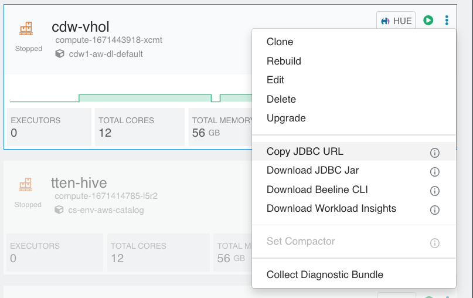
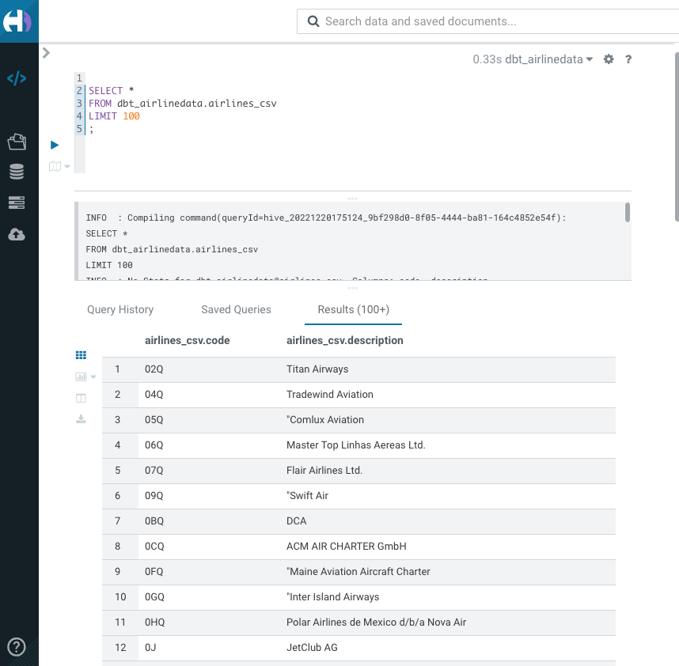
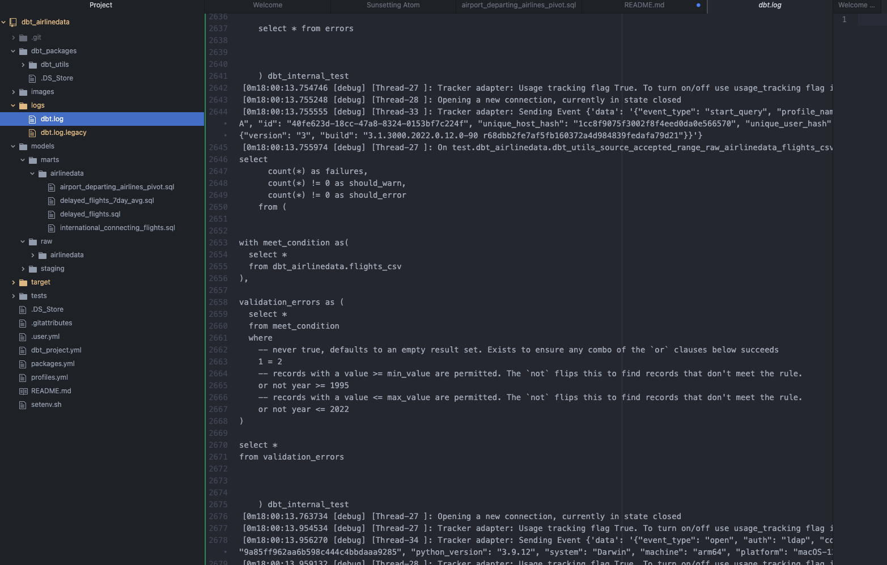

# dbt_airlinedata

## Prerequisits

### on your workstation
Python >= 3.9 <= 3.12
dbt-core >= 1.9.0
git


### CDP - Prerequisits

Provisioned a Hive CDW virtual warehouse
Loaded airlinedata set into S3 buckets of your CDP environment

## Create a project in Cloudera AI Workbench

Start by cloning this GitHub repo
```
https://github.com/frothkoetter/dbt_airlinedata_demo
```
Set the environment variable WORKLOAD_PASSWORD in User Settings

Next open a session with Python and install the dbt components

```
pip install dbt-core==1.10.8 dbt-hive==1.10.0
```

## Install dbt dependency packages dbt_utils and dbt_expectations
```
dbt deps
```
Expected output

```
16:17:52  Running with dbt=1.10.8
16:17:55  Installing dbt-labs/dbt_utils
16:17:59  Installed from version 1.0.0
16:17:59  Updated version available: 1.3.3
16:17:59  Installing metaplane/dbt_expectations
16:18:03  Installed from version 0.10.10
16:18:03  Up to date!
16:18:03  Installing godatadriven/dbt_date
16:18:04  Installed from version 0.17.1
16:18:04  Up to date!
16:18:04  
16:18:04  Updates available for packages: ['dbt-labs/dbt_utils']                 
Update your versions in packages.yml, then run dbt deps
```

### Configure connection to Cloudera Data Warhouse (Hive)


% vi profil.yml
```
Navigate to profil.yml and adjust the environment variables

```
dbt_airlinedata:
  outputs:
#  Development Output
    dev_hive:
      type: hive
      use_http_transport: true
      use_ssl: true
      auth_type: ldap #now also support kerberos
      schema: "dbt_airlinedata_demo"
      user: "frothkoetter"
      password: "{{ env_var('WORKLOAD_PASSWORD') }}"
      host: hs2-cdw-aw-se-hive.dw-se-sandbox-aws.a465-9q4k.cloudera.site
      port: 443
      http_path: "jdbc:hive2://hs2-cdw-aw-se-hive.dw-se-sandbox-aws.a465-9q4k.cloudera.site/default;transportMode=http;httpPath=cliservice;socketTimeout=60;ssl=true;auth=browser;"
      threads: 2

```
The HOST: and HTTP_PATH copy from your CDW Hive virtual warehouse JDBC link



change in model/raw/airlinedata/raw_airlinedata add your name to the schema: dbt_airlinedata_YOURNAME

```
version: 2

sources:
  - name: raw_airlinedata
    schema: dbt_airlinedata_frothkoetter
    tables:
      - name: flights_csv
        columns:
        - name: year
          tests:
           - not_null
           - dbt_utils.accepted_range:
              min_value: 1995
              max_value: 2023
```

### Check installation

```
% dbt debug
```
Expected output

```
16:24:36  Running with dbt=1.10.8
16:24:37  dbt version: 1.10.8
16:24:37  python version: 3.10.19
16:24:37  python path: /usr/local/bin/python3.10
16:24:37  os info: Linux-6.1.159-182.297.amzn2023.x86_64-x86_64-with-glibc2.39
16:24:37  Using profiles dir at /home/cdsw
16:24:37  Using profiles.yml file at /home/cdsw/profiles.yml
16:24:37  Using dbt_project.yml file at /home/cdsw/dbt_project.yml
16:24:37  adapter type: hive
16:24:37  adapter version: 1.10.0
16:24:37  Configuration:
16:24:37    profiles.yml file [OK found and valid]
16:24:37    dbt_project.yml file [OK found and valid]
16:24:37  Required dependencies:
16:24:37   - git [OK found]

16:24:37  Connection:
16:24:37    host: hs2-cdw-aw-se-hive.dw-se-sandbox-aws.a465-9q4k.cloudera.site
16:24:37    schema: dbt_airlinedata_demo
16:24:37    user: frothkoetter
16:24:37  Registered adapter: hive=1.10.0
16:24:41    Connection test: [OK connection ok]

16:24:41  All checks passed!
```

# Prepare CDW Virtual warehouse

Go to HUE and create a datebase

```SQL
create database dbt_airlinedata;
```

Create external tables of the airlinedata set in S3

```SQL
use dbt_airlinedata;

drop table if exists flights_csv;
CREATE EXTERNAL TABLE flights_csv(month int, dayofmonth int,
 dayofweek int, deptime int, crsdeptime int, arrtime int,
 crsarrtime int, uniquecarrier string, flightnum int, tailnum string,
 actualelapsedtime int, crselapsedtime int, airtime int, arrdelay int,
 depdelay int, origin string, dest string, distance int, taxiin int,
 taxiout int, cancelled int, cancellationcode string, diverted string,
 carrierdelay int, weatherdelay int, nasdelay int, securitydelay int,
lateaircraftdelay int, year int)
ROW FORMAT DELIMITED FIELDS TERMINATED BY ',' LINES TERMINATED BY '\n'
STORED AS TEXTFILE LOCATION '/airlinedata-csv/flights' tblproperties("skip.header.line.count"="1");

drop table if exists planes_csv;
CREATE EXTERNAL TABLE planes_csv(tailnum string, owner_type string, manufacturer string, issue_date string, model string, status string, aircraft_type string, engine_type string, year int)
ROW FORMAT DELIMITED FIELDS TERMINATED BY ',' LINES TERMINATED BY '\n'
STORED AS TEXTFILE LOCATION '/airlinedata-csv/planes' tblproperties("skip.header.line.count"="1");

drop table if exists airlines_csv;
CREATE EXTERNAL TABLE airlines_csv(code string, description string) ROW FORMAT DELIMITED FIELDS TERMINATED BY ',' LINES TERMINATED BY '\n'
STORED AS TEXTFILE LOCATION '/airlinedata-csv/airlines' tblproperties("skip.header.line.count"="1");

drop table if exists airports_csv;
CREATE EXTERNAL TABLE airports_csv(iata string, airport string, city string, state DOUBLE, country string, lat DOUBLE, lon DOUBLE)
ROW FORMAT DELIMITED FIELDS TERMINATED BY ',' LINES TERMINATED BY '\n'
STORED AS TEXTFILE LOCATION '/airlinedata-csv/airports' tblproperties("skip.header.line.count"="1");

```

Check that tables created and accessing the files in S3

```SQL
select * from airlines_csv;
```

Expected Output



# Run dbt

## testing your raw data

Testing the raw data

```
dbt test
```
The runtime of the test is approximate 5 minutes

Expected output
```
18:00:08  Running with dbt=1.3.0
18:00:08  Unable to do partial parsing because profile has changed
18:00:08  Unable to do partial parsing because env vars used in profiles.yml have changed
18:00:08  [WARNING]: Configuration paths exist in your dbt_project.yml file which do not apply to any resources.
There are 2 unused configuration paths:
- models.dbt_airlinedata.airlinedata
- seeds.dbt_hive_demo.reference

18:00:08  Found 9 models, 7 tests, 0 snapshots, 0 analyses, 439 macros, 0 operations, 0 seed files, 5 sources, 0 exposures, 0 metrics
18:00:08  
18:00:13  Concurrency: 2 threads (target='dev')
18:00:13  
18:00:13  1 of 7 START test dbt_utils_source_accepted_range_raw_airlinedata_flights_csv_year__2022__1995  [RUN]
18:00:13  2 of 7 START test dbt_utils_source_not_empty_string_raw_airlinedata_airlines_csv_description  [RUN]
18:05:14  2 of 7 PASS dbt_utils_source_not_empty_string_raw_airlinedata_airlines_csv_description  [PASS in 300.56s]
18:05:14  3 of 7 START test source_length_raw_airlinedata_airports_csv_iata__3 ........... [RUN]
18:06:02  3 of 7 FAIL 42 source_length_raw_airlinedata_airports_csv_iata__3 .............. [FAIL 42 in 48.63s]
18:06:02  4 of 7 START test source_not_null_raw_airlinedata_airlines_csv_code ............ [RUN]
18:06:05  4 of 7 PASS source_not_null_raw_airlinedata_airlines_csv_code .................. [PASS in 2.42s]
18:06:05  5 of 7 START test source_not_null_raw_airlinedata_flights_csv_year ............. [RUN]
18:06:52  1 of 7 PASS dbt_utils_source_accepted_range_raw_airlinedata_flights_csv_year__2022__1995  [PASS in 398.45s]
18:06:52  6 of 7 START test source_unique_raw_airlinedata_airlines_csv_code .............. [RUN]
18:06:52  5 of 7 FAIL 10 source_not_null_raw_airlinedata_flights_csv_year ................ [FAIL 10 in 46.88s]
18:06:52  7 of 7 START test source_unique_raw_airlinedata_airports_csv_iata .............. [RUN]
18:06:54  7 of 7 PASS source_unique_raw_airlinedata_airports_csv_iata .................... [PASS in 2.49s]
18:06:54  6 of 7 PASS source_unique_raw_airlinedata_airlines_csv_code .................... [PASS in 2.65s]
18:06:55  
18:06:55  Finished running 7 tests in 0 hours 6 minutes and 46.24 seconds (406.24s).
18:06:55  
18:06:55  Completed with 2 errors and 0 warnings:
18:06:55  
18:06:55  Failure in test source_length_raw_airlinedata_airports_csv_iata__3 (models/raw/airlinedata/raw_airlinedata.yml)
18:06:55    Got 42 results, configured to fail if != 0
18:06:55  
18:06:55    compiled Code at target/compiled/dbt_airlinedata/models/raw/airlinedata/raw_airlinedata.yml/source_length_raw_airlinedata_airports_csv_iata__3.sql
18:06:55  
18:06:55  Failure in test source_not_null_raw_airlinedata_flights_csv_year (models/raw/airlinedata/raw_airlinedata.yml)
18:06:55    Got 10 results, configured to fail if != 0
18:06:55  
18:06:55    compiled Code at target/compiled/dbt_airlinedata/models/raw/airlinedata/raw_airlinedata.yml/source_not_null_raw_airlinedata_flights_csv_year.sql
18:06:55  
18:06:55  Done. PASS=5 WARN=0 ERROR=2 SKIP=0 TOTAL=7
```
The activity is logged and you can log into the logfile when running the generic_test_sql



Above is the code that dbt generates for testing accepated values or ranges, in this example the column year in the flights_csv table is checked to be in a range.

Not all test pass - but thats for the demo purpose

## create models

Here you create Hive managed tables into the staging area and create the models.
```
dbt run
```

Expected Output

```
18:10:39  Running with dbt=1.3.0
18:10:39  [WARNING]: Configuration paths exist in your dbt_project.yml file which do not apply to any resources.
There are 2 unused configuration paths:
- models.dbt_airlinedata.airlinedata
- seeds.dbt_hive_demo.reference

18:10:39  Found 9 models, 7 tests, 0 snapshots, 0 analyses, 439 macros, 0 operations, 0 seed files, 5 sources, 0 exposures, 0 metrics
18:10:39  
18:10:48  Concurrency: 2 threads (target='dev')
18:10:48  
18:10:48  1 of 9 START sql table model dbt_airlinedata.stg_airlinedata__airlines ......... [RUN]
18:10:48  2 of 9 START sql table model dbt_airlinedata.stg_airlinedata__airports ......... [RUN]
18:10:54  1 of 9 OK created sql table model dbt_airlinedata.stg_airlinedata__airlines .... [OK in 5.80s]
18:10:54  3 of 9 START sql table model dbt_airlinedata.stg_airlinedata__flights .......... [RUN]
18:10:54  2 of 9 OK created sql table model dbt_airlinedata.stg_airlinedata__airports .... [OK in 5.81s]
18:10:54  4 of 9 START sql table model dbt_airlinedata.stg_airlinedata__planes ........... [RUN]
18:12:03  4 of 9 OK created sql table model dbt_airlinedata.stg_airlinedata__planes ...... [OK in 69.08s]
18:12:03  5 of 9 START sql table model dbt_airlinedata.stg_airlinedata__unique_tickets ... [RUN]
18:13:07  5 of 9 OK created sql table model dbt_airlinedata.stg_airlinedata__unique_tickets  [OK in 64.21s]
18:14:05  3 of 9 OK created sql table model dbt_airlinedata.stg_airlinedata__flights ..... [OK in 190.67s]
18:14:05  6 of 9 START sql table model dbt_airlinedata_mart_airlinedata.airport_departing_airlines_pivot  [RUN]
18:14:05  7 of 9 START sql table model dbt_airlinedata_mart_airlinedata.delayed_flights .. [RUN]
18:14:17  6 of 9 OK created sql table model dbt_airlinedata_mart_airlinedata.airport_departing_airlines_pivot  [OK in 12.73s]
18:14:17  8 of 9 START sql table model dbt_airlinedata_mart_airlinedata.delayed_flights_7day_avg  [RUN]
18:14:18  7 of 9 OK created sql table model dbt_airlinedata_mart_airlinedata.delayed_flights  [OK in 12.83s]
18:14:18  9 of 9 START sql incremental model dbt_airlinedata_mart_airlinedata.international_connecting_flights  [RUN]
18:14:33  8 of 9 OK created sql table model dbt_airlinedata_mart_airlinedata.delayed_flights_7day_avg  [OK in 15.44s]
18:16:01  9 of 9 OK created sql incremental model dbt_airlinedata_mart_airlinedata.international_connecting_flights  [OK in 103.42s]
18:16:01  
18:16:01  Finished running 8 table models, 1 incremental model in 0 hours 5 minutes and 21.90 seconds (321.90s).
18:16:01  
18:16:01  Completed successfully
18:16:01  
18:16:01  Done. PASS=9 WARN=0 ERROR=0 SKIP=0 TOTAL=9
```

### Run a single model

```
% dbt run -s airport_departing_airlines_pivot
```

Expected Output

```
16:55:36  Running with dbt=1.3.0
16:55:36  [WARNING]: Configuration paths exist in your dbt_project.yml file which do not apply to any resources.
There are 2 unused configuration paths:
- models.dbt_airlinedata.airlinedata
- seeds.dbt_hive_demo.reference

16:55:36  Found 9 models, 7 tests, 0 snapshots, 0 analyses, 439 macros, 0 operations, 0 seed files, 5 sources, 0 exposures, 0 metrics
16:55:36  
16:55:44  Concurrency: 1 threads (target='dev_hive')
16:55:44  
16:55:44  1 of 1 START sql table model dbt_airlinedata_mart_airlinedata.airport_departing_airlines_pivot  [RUN]
17:01:49  1 of 1 OK created sql table model dbt_airlinedata_mart_airlinedata.airport_departing_airlines_pivot  [OK in 365.41s]
17:01:49  
17:01:49  Finished running 1 table model in 0 hours 6 minutes and 13.77 seconds (373.77s).
17:01:49  
17:01:49  Completed successfully
17:01:49  
17:01:49  Done. PASS=1 WARN=0 ERROR=0 SKIP=0 TOTAL=1
```
